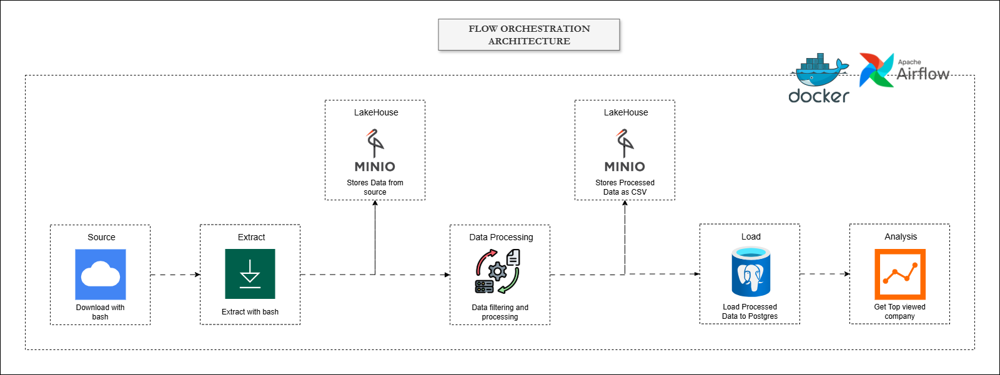
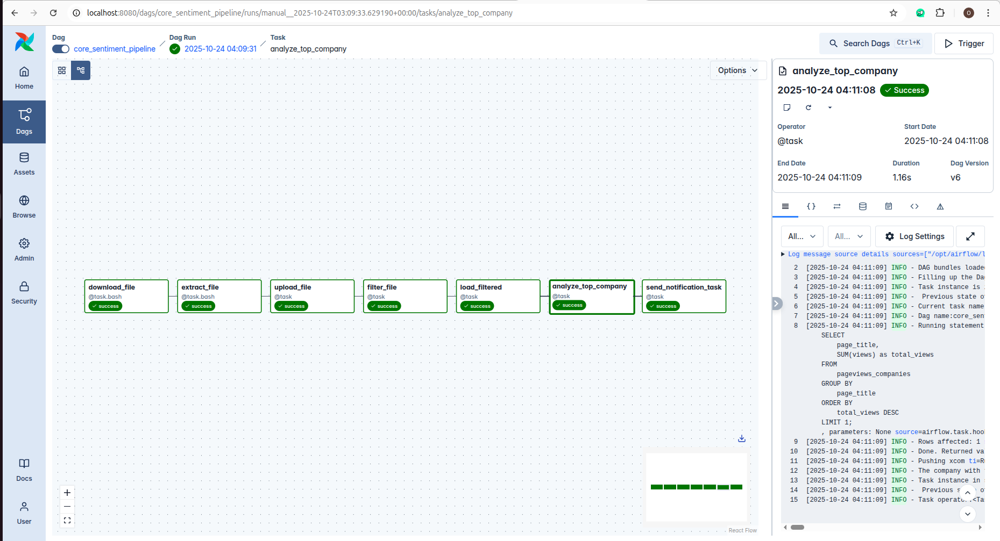

# CoreSentiment: Wikipedia Pageviews Data Pipeline  
**An Apache Airflow–based data pipeline for stock market sentiment analysis using Wikipedia pageviews**

---

## Project Overview  
This project demonstrates how to design and orchestrate a **batch data pipeline** in **Apache Airflow** to collect and process **Wikipedia pageview data** for sentiment analysis.  



The hypothesis:  
> “A spike in a company’s Wikipedia pageviews might correlate with increased public sentiment or interest, potentially reflecting stock market trends.”  

This pipeline automates the process — from **data ingestion** to **storage**, **transformation**, and **analysis** — using **Airflow**, **MinIO**, and **PostgreSQL**.  

---

## Project Scenario  
As a **Data Engineer** at *CoreSentiment*, your team’s goal is to validate a hypothesis that public attention (measured via Wikipedia views) may signal stock movement.  

For this first iteration, you were tasked to:  
- Download the Wikipedia pageviews data for **any one-hour period in October 2025**.  
- Extract and filter for **five major companies**: `Amazon`, `Apple`, `Facebook`, `Google`, and `Microsoft`.  
- Load the cleaned results into a **PostgreSQL database**.  
- Run a query to identify **which company had the highest pageviews** in that hour.  

This is the foundation of a scalable, automated data pipeline for market sentiment monitoring.

---

## Data Source  

The dataset comes from **The Wikimedia Foundation**, which publishes hourly pageview dumps since 2015. These files are machine-readable, in **gzip** format, and available publicly at:  
[https://dumps.wikimedia.org/other/pageviews/](https://dumps.wikimedia.org/other/pageviews/)

Each hourly dump is about **50MB gzipped** (~200–250MB unzipped) and contains all pageviews for that hour across all Wikipedia domains.

**Example URL structure:**  

[Download the Wikipedia pageviews file for 2025-10-10 16:00 UTC](https://dumps.wikimedia.org/other/pageviews/2025/2025-10/pageviews-20251010-160000.gz)

- `20251010-160000` → data for 15:00–16:00 UTC  
- Each line contains:
domain_code page_title view_count response_size

- Example:
en.m American_Bobtail 6 0

This means 6 pageviews for [American Bobtail](https://en.m.wikipedia.org/wiki/American_Bobtail) during that hour.

**Project Task Summary:**  
1. Download and extract the `.gz` file for a chosen hour in October 2025.  
2. Parse the text file and select only five company pages.  
3. Load the filtered records into PostgreSQL.  
4. Run an analysis to find the company with the highest pageviews.

---

## DAG Graph View  


```mermaid
graph TD
  A[Wikipedia Pageview Dumps] --> B(Download File)
  B --> C(Extract .gz File)
  C --> D[MinIO Object Storage]
  D --> E(Filter Relevant Companies)
  E --> F[PostgreSQL Database]
  F --> G(Analyze Highest Pageviews)

## Pipeline Workflow

| Task                | Operator          | Purpose                                                                 |
|---------------------|------------------|--------------------------------------------------------------------------|
| `download_file`     | `BashOperator`    | Downloads the hourly `.gz` pageview dump from Wikimedia                  |
| `extract_file`      | `BashOperator`    | Decompresses the downloaded file                                         |
| `upload_file`       | `PythonOperator`  | Uploads the extracted file to MinIO                                      |
| `filter_file`       | `PythonOperator`  | Downloads from MinIO, filters 5 companies, and re-uploads                |
| `load_filtered`     | `PythonOperator`  | Loads the filtered CSV into PostgreSQL                                   |
| `analyze_top_company` | `PythonOperator` | Runs SQL to find the company with the highest pageviews                  |
| `on_failure_callback` | `Callable Function` | Sends email alerts on DAG failure with traceback info                    |

## Implementation Highlights

### Virtual Environment Initialization

The project was first initialized in a Python virtual environment to ensure dependency isolation.

```bash
python -m venv venv
source venv/bin/activate
git init
```
Git was used to track every development stage before containerization.

---

## Dockerized Airflow

Airflow was installed using Docker Compose to ensure reproducibility, scalability, and environment parity with production systems.

## requirements.txt

The following dependencies power key components of the pipeline:

- **MinIO & S3 integration**
- **PostgreSQL access and SQL operations**
- **Email notifications**
- **Data analysis with Pandas**
- **Async DB connections**

---

## Dockerfile

### Why Docker?

- Provides a **consistent, isolated Airflow environment**  
- **Simplifies setup** across different machines  
- **Ready for production deployment** with minimal changes  
- **Avoids local dependency conflicts**

To launch Airflow:

```bash
docker-compose up -d --build
---

## MinIO for Object Storage

**MinIO** was chosen as an S3-compatible local object store, allowing testing of a cloud-like architecture locally.  
It simulates AWS S3 behavior perfectly for **Airflow + Spark + Data Lake** workflows.

---

## Failure Alerts via Custom Callable

A robust `send_email_failure_alert()` callable was implemented using:

```bash
from airflow.providers.smtp.notifications.smtp import send_smtp_notification
```

This function captures exceptions and automatically emails the failure details, DAG run ID, and log URL for quick debugging.

---

## Reliability Practices

- Configured `retries`, `retry_delay`, and alert callbacks  
- Ensured **idempotence** (tasks can rerun safely)  
- Used **Airflow connections** securely  

---

## Simple Analysis Step

Once data was loaded into **PostgreSQL**, a SQL query aggregated and identified the company with the highest pageviews — closing the data loop from **raw data → insight**.

---

## Thought Process

The thought process behind this pipeline was to mirror a **production-grade data engineering flow**:

1. **Raw Data Handling:** Download from public data source → decompress → persist in object store.  
2. **Data Refinement:** Clean and filter within a reproducible task.  
3. **Structured Storage:** Push curated data into a relational database.  
4. **Observability & Alerting:** Integrate failure notifications for production reliability.  
5. **Extensibility:** Easily scalable to include multiple hours, daily runs, or stock correlation data.

---

## Setup and Installation

```bash
# Clone repository
git clone https://github.com/<your-username>/core-sentiment-pipeline.git
cd core-sentiment-pipeline

# Start Airflow
docker-compose up -d --build
```
## Final Reuslt

- **End-to-end ETL orchestration** using Apache Airflow  
- **Data lake and warehouse architecture** with MinIO + PostgreSQL  
- **Custom failure alerting system** for production-grade monitoring  
- **Containerized and reproducible local setup** using Docker  
- Demonstrated **best practices** for data reliability, modularity, and observability  
